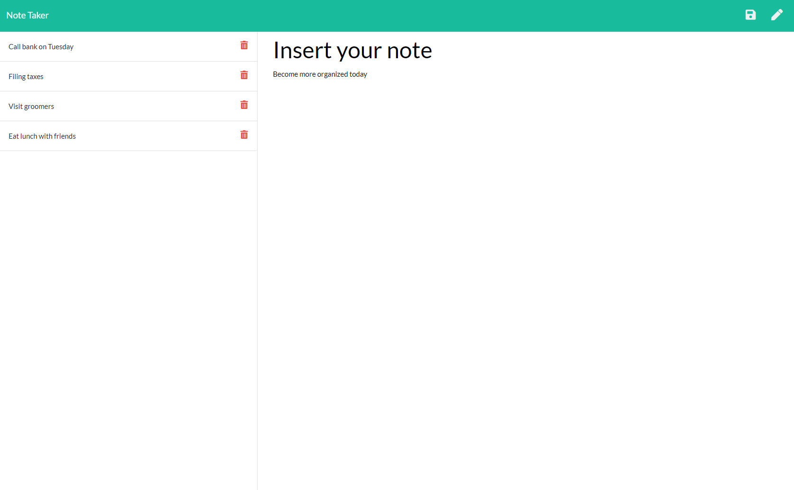

# Note Taker

## Table of Contents

* [Description](#description)
* [Usage](#usage)
* [Credits](#credits)
* [License](#license)

## Description

Is your life hectic? Do you need a better way to keep track of your day?

This note taking application will let you input all the tasks on your schedule. Simply type in your plans for the week, hit the save icon in the upper right of the screen, and your note will be saved on the column to the left. When you're ready to create a new note, simply click on the pencil and then type in a new title and text for your plans. To view the text of previous note, click on the title of your note. Once you've completed the task, you can tap the trash can icon, and the note will disappear.

You're guaranteed to feel more in control of your week with this helpful note taker app!

This application is written in JavaScript using Express.js and Node.js. It's deployed on Heroku.

## Usage

Navigate to [Soma Makela's Note Taker](https://stormy-hollows-84415.herokuapp.com/) and view the web page.

* Once you're there, type in a note title and text for your note.
* The save icon allows you to save your note.
* The pencil creates a new note.
* The trash can deletes your note.

## Credits

Created by [Soma Makela](https://github.com/smakela13).

## License

This website currently has No License, which means it is under exclusive copyright. No one can copy, distribute, or modify this website without permission.